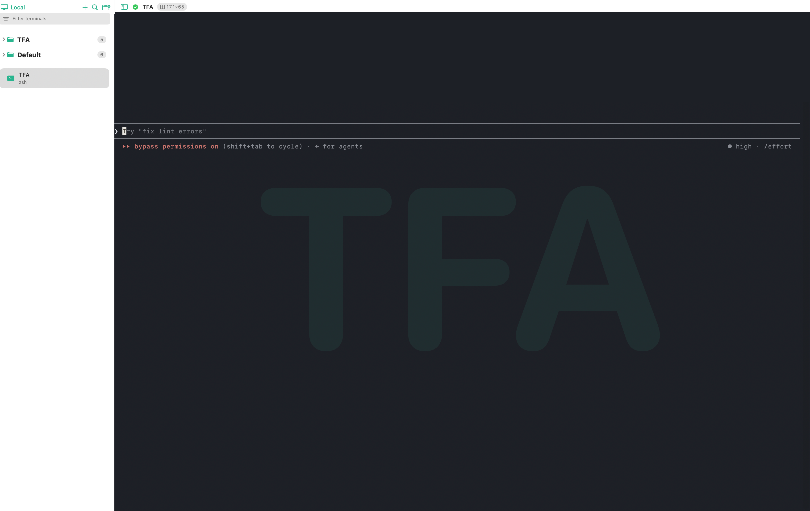

# TFA — 可视化的 tmux 终端管理器（macOS）

> TFA（Terminal For AI）是一个原生 macOS（SwiftUI）应用，为真实 tmux 会话提供一个可视化、
> 易用的管理界面——在一个窗口里管理大量本地与远程终端，断线不丢、随时重连。



> 📦 [**下载最新版 TFA.app**](https://github.com/wstart/TFA/releases/latest) · macOS 14+ · 需本机已安装 `tmux`

TFA 不是另写一个多路复用器，而是封装真实的 tmux：通过 tmux 的**控制模式**（`tmux -CC`）
与一个真正的 tmux server 通信。因此它保留了 tmux 的全部能力——会话持久、可脚本化、远程稳定——
同时提供一个原生、克制、可访问的图形界面。

---

## ✨ 核心理念

- **一个终端 = 一个 tmux 会话**，每个终端有自己独立的 `tmux -CC` 连接，各自实时流动；切换
  只是换显示，不需要 `switch-client`。
- **封装而非重写**：所有终端能力来自真实 tmux，TFA 只做可视化与管理。
- **断线不丢**：这正是 tmux 的意义所在。SSH 抖动、管道中断，只要会话还在，TFA 会自动重连。
- **分层、低耦合**：核心协议层 `TmuxKit` 不依赖任何 UI（仅 Foundation + Observation），便于复用或替换前端。

---

## 🧩 功能一览

**终端管理**
- 扁平的终端侧边栏（一个会话一行），点选切换。右键菜单：**重命名 / 环境变量 / 拷贝・粘贴环境变量 /
  重启 session / 克隆 session / Close（detach 保活）/ Kill（确认后销毁）**。
- `+` 新建本地终端（防撞命名 `mux-N`），网络图标新建 **SSH** 远程终端。
- 标题栏显示会话名、连接状态、ssh host、窗格尺寸，以及活动终端的**当前工作目录**。
- **启动续跑 + 懒加载**：打开 app 时发现本机已存在的 tmux 会话；发现的会话先作**休眠占位**，
  **选中时才真正连接**，会话再多也秒开。
- **退出保活**：退出 app 只 detach、不杀会话，下次启动恢复。
- **每会话环境变量**：右键终端 →「环境变量…」为该会话单独设置环境变量（tmux `set-environment`），
  持久化、(重)连接时自动注入。可「保存并重启 shell」或右键「重启 session」让当前 shell 立即生效；
  也支持在会话间**拷贝 / 粘贴环境变量**（走系统剪贴板，`KEY=VALUE`，兼容 `.env`）。
- **克隆 session**：按同一套配置（endpoint / host / 环境变量等）快速开一个新会话。

**管理大量终端**
- **侧边栏过滤框**：按名字 / 当前命令实时过滤 + 计数。
- **⌘K 快速切换**：键盘优先的模糊命令面板（子序列匹配名字 + 命令，↑↓/↵/esc）。
- **活动指示点 + 输出特效**：后台有新输出时行内亮品牌色圆点；**输出中**圆点脉冲、**输出结束**闪绿 ✓；
  **后台**终端输出结束还会发 macOS 系统通知。**⌘]** 跳到下一个有新输出的终端。
- **跨终端搜索（⌘F）**：并发 `capture-pane` 抓取所有终端文本，分组高亮，一键跳转。
- **分组**：把会话拖入可折叠分组；侧边栏与分组按 host 作用域隔离。

**健壮性**
- **断线自动重连**：非用户主动的断开 → 若会话仍在（本地查会话列表 / ssh 有界重试）→ 退避
  （0.5/1/2/4/8/8s，≤6 次）用 `attach-session` 重连；确实没了 / 重试耗尽 → 非阻断 toast + 移除。
- **失败态 + Retry**：连接失败显示**真实错误文本**与「Retry Connection」按钮（不再永久转圈）；
  重连中显示「Reconnecting… (attempt N)」。
- **断线 toast**：终端不会无故消失，会告诉你原因。
- **输出流控**：连接启用 tmux `pause-after` 背压——某终端疯狂输出（`yes`、大日志）不会撑爆内存或
  拖垮界面（旧 tmux 会静默降级）。
- **干净退出**：正常退出或被信号（`pkill` / 崩溃）终止时都会回收所有 `tmux -CC` 子进程，避免 pty 泄漏。

**外观 / 可访问性（见 [DESIGN.md](DESIGN.md)）**
- **设计系统**：统一的间距 / 圆角 / 字体 / 状态色 token + 品牌 teal（`Theme.swift`）。
- **统一状态指示**：连接状态用 **形状 + 颜色 + 标签**（非纯色，色盲友好），侧边栏与标题栏共用。
- **终端主题**：固定深色终端皮肤 + 品牌色光标 + **大号浅色会话名水印**（一眼认出当前终端）。
- **可访问性**：图标按钮 / 行 / 状态均有 VoiceOver 标签；装饰元素对辅助技术隐藏。
- **设置（⌘,）**：键入特效开关、字号，附快捷键速查表。

**🧰 侧边栏工具区**

侧边栏底部三个互斥入口，各自在详情区打开一个工具面板：

- **CLAUDE.md 规则编辑器**：直接编辑全局 `~/.claude/CLAUDE.md`，Markdown 语法高亮、⌘S 保存、
  从磁盘重新加载，文件不存在则保存时自动创建。
- **Skills 管理**：把 `~/.claude/skills` 当目录树浏览，编辑各 skill 的 `SKILL.md` 及附带脚本
  （md / py / shell / json 语法高亮，自动解析符号链接 skill）。
- **🧪 实验室（Lab）**：实验功能的容器，目前包含：
  - **系统监控**：实时 CPU / 内存 / 负载 / 运行时间 + GPU 型号（全公开 API；GPU 利用率 macOS 无公开 API，故仅显示型号）。
  - **Token 用量**：[ccusage](https://github.com/ryoppippi/ccusage) 的 Swift 移植（Claude Code + Codex 两源），
    读本机 `~/.claude` / `~/.codex` 的记录，按日 / 周 / 月 / 会话统计 token 与估算成本。
  - **PTY / 进程监控**：pty 用量 / 上限、TFA 的 `tmux -CC` 客户端与孤儿数、残留探针 socket，
    并可一键清理孤儿客户端释放 pty。

---

## 🏗 架构

```
┌──────────────────────────────────────────────────────────────┐
│ SwiftUI App  (target: Mux，依赖 SwiftTerm)                     │
│                                                               │
│  RootView ── 侧边栏(过滤/状态/活动点) │ 标题栏 │ 终端区 │ 搜索/⌘K │
│  AppModel ── 顶层状态：终端列表/选择/字号/搜索                  │
│  ConnectionSession ── 1 个连接 = 1 个终端 + 重连 + 窗格注册表    │
│  PaneTerminal ── 1 个 SwiftTerm 视图 + 水合 + 光标不变式         │
└───────────────────────────┬──────────────────────────────────┘
                            │  @Observable 绑定
        ┌───────────────────▼────────────────────────┐
        │ TmuxKit  (library，纯 Swift，无 UI 依赖)     │
        │                                             │
        │  TmuxController ── 应用事件流到 @Observable    │
        │                    TmuxState(会话/窗口/窗格)  │
        │  TmuxControlClient ── 协议解析 + FIFO 命令队列 │
        │  TmuxProtocolParser ── %output/%begin/%end/%  │
        │  PtyProcessTransport ─ 本地: `tmux -CC`        │
        │                     └ 远程: `ssh host tmux -CC`│
        │  LayoutParser / TmuxServer / Models           │
        └───────────────────┬─────────────────────────┘
                            │ PTY (raw) ← 控制协议字节流
                       真实 tmux server
```

- **每个 tmux 窗格（`%id`）** ↔ 一个 SwiftTerm 视图：把 `%output` 字节喂进去渲染，用户键盘输入经
  `send-keys -H`（十六进制，二进制安全）回传 tmux。窗格注册表**按连接隔离**（`%id` 只在单 server 内唯一）。
- **TmuxKit 零 UI 依赖**（仅 Foundation + Observation），便于将来替换前端；SwiftTerm 只在 app target 用到。

---

## 🎯 两个关键难点

### 1) 光标不变式
`capture-pane` 恢复屏幕文本但**不恢复光标**，且它与 CUP 都是相对 tmux **真实窗格尺寸**度量的。
若 SwiftTerm 引擎的网格与 tmux 窗格尺寸不一致（例如后台会话仍是默认 24 行，或被其它客户端
reconcile 成别的尺寸），光标就会落到错误的行。

**约束**：任何 capture / CUP 之前，必须先把引擎钉到 tmux 的 `paneSize`。该不变量收口在
`PaneTerminal.pinEngineToPaneSize()` **一处**——每条触碰光标的路径都必须经过它，重构时不会悄悄回归。

### 2) 断线自动重连
`ConnectionSession` 在非用户主动的断开时换上一个全新的 `TmuxController`（`attach-session`），
bump `generation` 触发重水合；退避策略 `backoffDelay(attempt:)` 是纯函数。语义保证：
**掉线 → 重连；kill → 只 finalize 一次，不死循环；用户主动 detach → 不重连**。

---

## 📁 目录结构

```
Package.swift
Sources/
  TmuxKit/            # 核心：协议解析、模型、PTY 传输、状态控制器(无 UI 依赖)
    Transport.swift / ControlProtocol.swift / ControlClient.swift
    TmuxController.swift / TmuxState(Models.swift) / LayoutParser.swift
    TmuxServer.swift / Connection.swift / PTY.swift / Errors.swift
  Mux/                # SwiftUI 应用
    MuxApp.swift / RootView.swift / SidebarView.swift / TerminalAreaView.swift
    AppModel.swift / ConnectionSession.swift / PaneTerminal.swift / TerminalPaneView.swift
    SearchView.swift / QuickSwitchView.swift / SettingsView.swift / Theme.swift
    Lab.swift（实验室：系统监控 / PTY 监控）/ Notifications.swift（输出完成通知）
    ClaudeMd.swift（CLAUDE.md 编辑器）/ Skills.swift（Skills 管理 + 语法高亮编辑器）
    CCUsage*.swift（Token 用量：ccusage 的 Swift 移植，Claude + Codex 两源）
docs/
  tmux-control-protocol.md     # tmux 控制协议规格（编码依据）
  swiftterm-integration.md     # SwiftTerm 集成规格
DESIGN.md             # 设计系统单一真源（token / 状态模型 / 组件 / 终端主题）
```

---

## 🛠 构建 / 运行 / 打包

```sh
swift build                      # 编译全部（含 app）
swift run Mux                    # 开发跑（SwiftPM target 仍叫 Mux）

# 打包成可双击的 TFA.app（改完代码务必重打包再测，否则 open 的是旧包）：
./scripts/build-app.sh release
codesign --force --deep --sign - TFA.app
open TFA.app
```

> **依赖**：本机已安装 `tmux`（控制模式必需）。远程功能依赖系统 `ssh` 与你既有的 SSH 配置 / 密钥。
> 工具链：Swift 6，各 target `.swiftLanguageMode(.v5)`，SwiftTerm 1.13.0（仅 app）。

---

## ⌨️ 快捷键

| 键 | 作用 | | 键 | 作用 |
|---|---|---|---|---|
| ⌘T | 新建终端 | | ⌘F | 跨终端搜索 |
| ⌘W | 关闭（detach，会话保活） | | ⌘K | 快速切换面板 |
| ⌘1–9 | 选第 N 个终端 | | ⌘] | 跳到下一个有新输出的终端 |
| ⌘⌥← / → | 上一个 / 下一个终端 | | ⌘\ | 折叠 / 展开侧边栏 |
| ⌘ + / − / 0 | 字号 增 / 减 / 重置 | | ⌘, | 设置（含快捷键速查） |
| ⌘S | 编辑器内保存（CLAUDE.md / SKILL.md） | | ⌘R | 失败态重试连接 |

---

## 🔬 技术要点（均按真实 tmux 3.6a 字节验证）

- `tmux -CC` **必须真 PTY**（纯管道会 `tcgetattr failed`）→ `openpty` + `cfmakeraw`（关回显）+
  `posix_spawn(SETSID)`；输入 `send-keys -t %ID -H <hex>`，尺寸 `refresh-client -C WxH`。
- 协议：`%output` 八进制解码、`%begin/%end/%error` 帧、`%`-通知、DCS 握手；命令回复按
  `flags==1` 块 FIFO 配对（`ControlClient` 抛出真实 `%error`/`%exit` 文本，横幅显示真因）。
- 远程：`ssh -tt … env PATH=… tmux -CC`——一次性命令走 `shell -c` 不读登录配置，显式带上
  Homebrew / 系统 bin 目录，避免 macOS 远程主机找不到 `tmux`。
- SwiftTerm 1.13.0：`view.feed(byteArray:)` 喂字节；输入经 delegate `send(source:data:)`；
  Swift-6 需 `@MainActor TerminalViewDelegate`。
- 终端主题用**固定 sRGB 深色**前 / 背景（不随系统外观漂移），避免新建窗格首帧出现浅 / 深错色条带。

---

## 🗺 状态 / 路线图

- [x] **协议层** — 控制协议解析 / PTY 传输 / 控制客户端 / 状态控制器
- [x] **本地 MVP** — 本地 `tmux -CC`、侧边栏、SwiftTerm 单窗格、新建 / 切换 / 重命名 / 关闭
- [x] **跨终端搜索** — 并发搜索，分组高亮跳转
- [x] **健壮性** — 自动重连 / 失败态 + Retry / 断线 toast / 退出回收子进程
- [x] **界面 / 可访问性** — 设计系统 + 统一状态 + 活动点 + 过滤 + ⌘K + 增强标题栏 + 终端主题
- [x] **远程 SSH** — `ssh -tt … tmux -CC` + 交互式登录（密码 / 主机指纹 / 2FA），检测控制模式开场符后交接
- [x] **交互打磨** — 跨 host 跳转跟随、活动导航、detach 撤销、拖拽分组、字号 HUD、设置窗口
- [x] **性能** — 懒加载 attach（按需连接）、tmux 流控（`pause-after` 背压）
- [x] **输出特效 + 通知** — 输出中脉冲 / 结束闪 ✓ / 后台完成系统通知
- [x] **每会话环境变量** — `set-environment` + 重启生效 + 会话间拷贝 / 粘贴 + 克隆 session
- [x] **侧边栏工具区** — CLAUDE.md 规则编辑器 / Skills 管理（语法高亮编辑器）
- [x] **实验室** — 系统监控 / Token 用量（ccusage 移植）/ PTY · 进程监控
- [ ] **下一步** — 实验室更多实验（端口 / 布局可视化）、输出合并 feed 优化

---

## 📚 延伸阅读

- [`CHANGELOG.md`](CHANGELOG.md) — 版本变更记录
- [`DESIGN.md`](DESIGN.md) — 设计系统（token、状态模型、组件、终端主题）
- [`docs/tmux-control-protocol.md`](docs/tmux-control-protocol.md) — tmux 控制协议规格
- [`docs/swiftterm-integration.md`](docs/swiftterm-integration.md) — SwiftTerm 集成规格

---

## 📄 License

[Apache License 2.0](LICENSE) © wstart.
